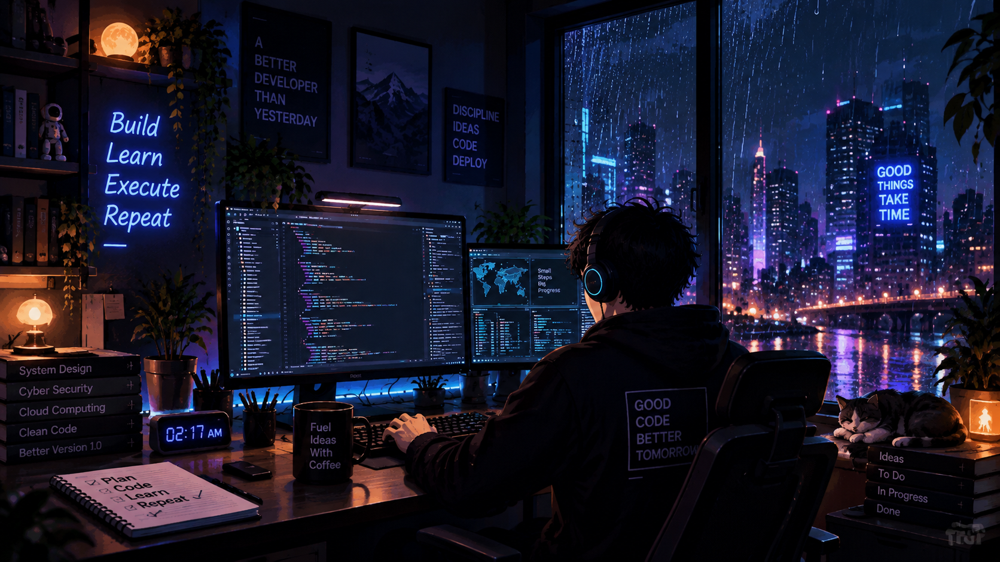
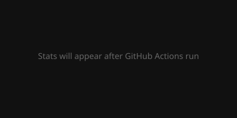

  

  

<h1 align="center">
  Devraj Singhal
</h1>

  <b>Cybersecurity • Full Stack Development • Cloud • Backend Engineering</b>

 

## About Me

Cybersecurity-focused Computer Science undergraduate with strong foundations in Data Structures & Algorithms, Object-Oriented Programming, DBMS, Operating Systems, Computer Networks, and System Design. Interested in cybersecurity, SOC operations, threat detection, secure software development, backend engineering, cloud technologies, and building reliable systems.

- 🎓 **Education:** B.Tech CSE (Cyber Security) student at Vellore Institute of Technology (VIT)
- 🔒 **Interests:** Threat detection, SOC monitoring, secure and reliable systems, cloud security
- 💻 **Focus:** Currently improving technical and problem-solving skills across full-stack and backend development
- 🚀 **Foundation:** Strong DSA foundation

 

## Profile Views

  

 

## Reach Me

  
  
  
  

 

## Tech Stack

### Languages

  
  
  
  
  

### Frameworks / Libraries

  
  
  
  

### Security Tools

  
  
  
  

### Cloud / Platforms

  
  

### Core CS & Security
> Data Structures & Algorithms • Object-Oriented Programming • DBMS • Operating Systems • Computer Networks • System Design • Cybersecurity • Threat Detection • OWASP Top 10 • SOC Monitoring • Incident Response • Vulnerability Assessment

 

## Experience

### SOC L1 Intern
**Techniki IT Solutions | Firozabad, India | May 2026 – Jul 2026**
- Monitored and categorized security alerts weekly using SIEM tools.
- Identified phishing, malware, and network-based threats.
- Performed vulnerability assessments and maintained remediation records.
- Prepared incident response reports containing technical findings and actionable recommendations.

### Cyber Security Intern
**The Red Users | Remote | Feb 2025 – Mar 2025**
- Conducted web application security testing based on OWASP Top 10.
- Detected and documented SQL Injection, XSS, and CSRF vulnerabilities.
- Used Wireshark for packet analysis to identify and eliminate plaintext credential exposure.

 

## Achievements & LeetCode

  

- Solved 250+ DSA problems on LeetCode.
- Achieved a 50-day LeetCode streak badge.
- LeetCode rating: 1480.
- Ranked in the Top 2.5% among 40,000+ participants in AlgoUniversity Graphs Camp.
- Qualified the Graphs Completion Test.

 

## Certifications

- **Microsoft Certified:** Security Operations Analyst Associate (SC-200)
- **AWS Certified:** Cloud Practitioner

 

## GitHub Stats

<picture>
  <source media="(prefers-color-scheme: dark)" srcset="./assets/overview.dark.svg">
  <source media="(prefers-color-scheme: light)" srcset="./assets/overview.light.svg">
  
</picture>

 

## Most Used Languages

<picture>
  <source media="(prefers-color-scheme: dark)" srcset="./assets/languages.dark.svg">
  <source media="(prefers-color-scheme: light)" srcset="./assets/languages.light.svg">
  
</picture>

 

## Cyber Security Contribution Activity

  

 

## Extracurricular

- **Edu4U Club:** Finance Team Member
- **AdVitya 2025:** Discipline Team Member
- **AdVitya 2026:** Discipline Team Member

 

---

  <b>Building secure systems. Solving hard problems. Learning continuously.</b>

